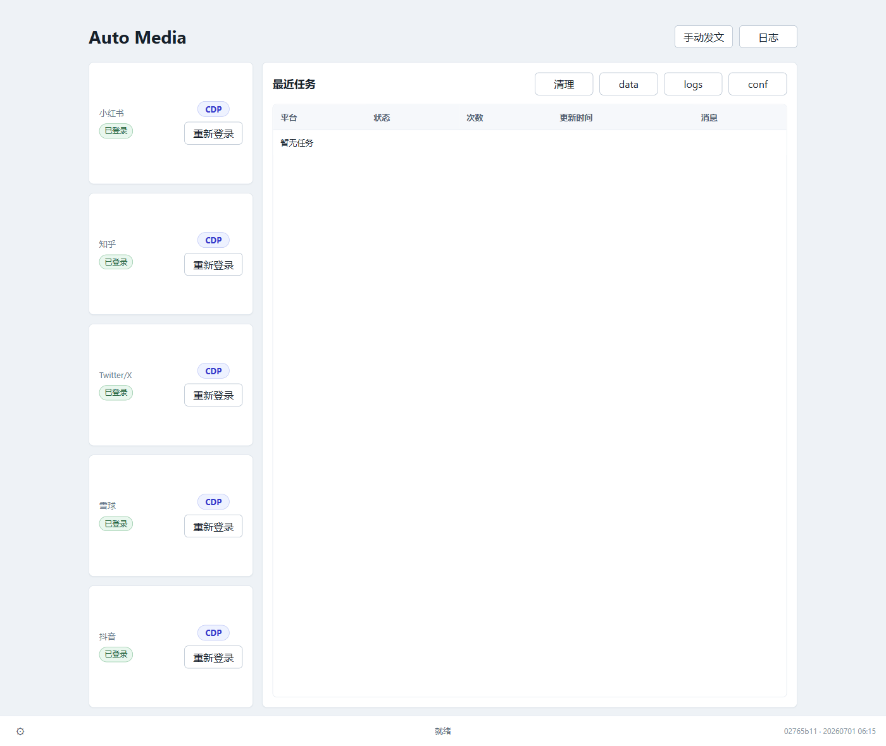

# Auto Media

Rust + Tauri 桌面自动发布工具。详细方案见 `system_design.md`。

## 简介

Auto Media 是一个运行在 Windows 上的桌面应用,用来把每天的一张图片 + 文案一键发布到五大社媒平台:**小红书、知乎、Twitter/X、雪球、抖音**。

- **CDP 优先,API 兜底**:每个平台都有「浏览器自动化(CDP)」和「HTTP API」两套后端,默认走 CDP 真实操作(更像真人、降低风控),失败再回退 API。
- **真实话题**:按配置的 tags 在各平台选择真实的话题标签(而非纯文本 `#xxx`),小红书正文不残留无效标签。
- **共享单浏览器**:所有平台共用一个 Chrome profile、单窗口多标签顺序发布;发布完成后自动关闭,遇到短信/验证码会保留窗口等你完成验证。
- **图片水印**:发布前自动给图片右下角加水印,可在配置里按平台开关和自定义文本(知乎/雪球/Twitter 用站点链接,小红书/抖音用纯品牌词以降低站外引流风险)。
- **手动发文**:可手动选图、填标题/正文/标签、勾选目标平台(选择会被持久化),点击图片可预览「加好水印后的发布效果」。



## 目录

- `src`: Rust/Tauri 源码和静态前端。
- `bin`: release 二进制输出目录,应用固定从这里启动。
- `conf`: 配置、状态库、认证状态和浏览器 profile。
- `data`: 待发布图片目录。
- `logs`: 运行日志目录。

## 构建与启动

应用统一从 `bin\auto_media.exe` 启动。用部署脚本一键构建(release)+ 部署到 `bin` + 启动:

```powershell
pwsh scripts\deploy.ps1            # 构建 release 并拷贝到 bin\auto_media.exe
pwsh scripts\deploy.ps1 -Launch    # 顺带从 bin 启动
```

构建/测试:

```powershell
cargo check
cargo test
```

## 功能进度

- Tauri GUI、系统托盘、开机自启动、配置加载、日志、SQLite 状态库、防重复发布。
- 五大平台(小红书 / 知乎 / Twitter-X / 雪球 / 抖音)均已接入 CDP 图文发布 + 真实话题 + API 回退,统一在 `src/platforms/{platform}_cdp.rs` / `{platform}_api.rs` 中维护。
- 发布前图片水印、手动发文平台持久化、每平台 CDP/API 切换、发布后自动关闭浏览器(验证场景保留窗口)。
